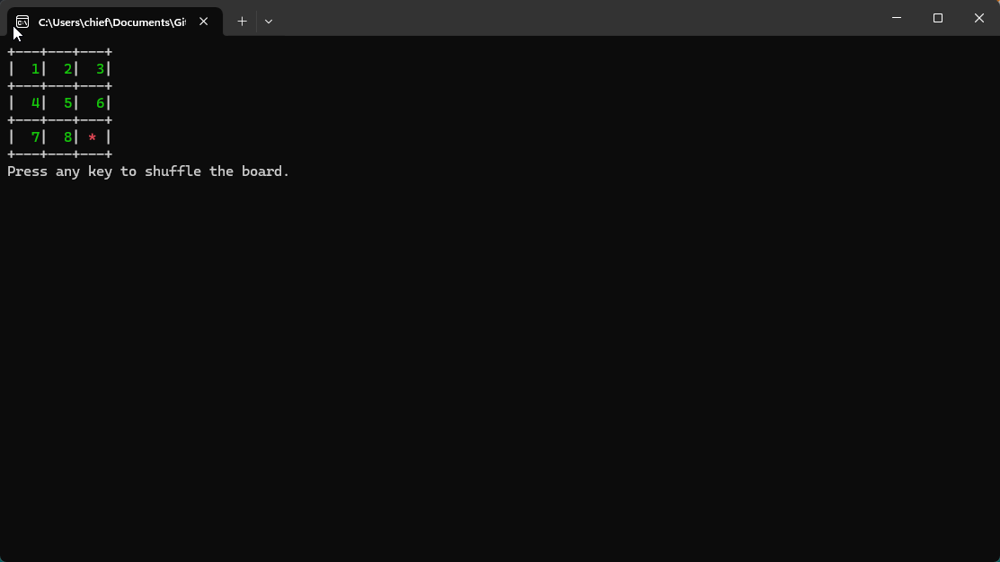

# Sliding Puzzle

A simple sliding puzzle mini game that runs on Windows Console made in C++

## Features
    Error handling,
    UI design, 
    Windows API calls,
    Random behaviors, 
    Simple refreshing and keystroke processing.

## How to Run
Using an IDE (e.g., Visual Studio, CLion, Code::Blocks)

    Open Your IDE and create a new C++ console project.
    Add Source Files:
        Copy the contents of source.cpp into your project's main source file.
        Build and Run the project.

Or you could simply run the exe from x64/Debug/Sliding Puzzle PHASS CPP.exe 

## Demo Output

